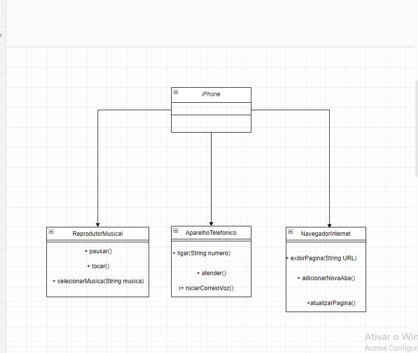

<h1 style="text-align: center">Desafio POO</h1>

<h2>Modelagem e Diagramação de um Componente iPhone</h2>

<h3> 📰 Sobre</h3>

Elaborar a diagramação das classes e interfaces utilizando uma ferramenta UML. Em seguida, implementar as classes e interfaces no formato de arquivos .java .

<h3> 📰 Funcionalidades a Modelar</h3>

<h4>Reprodutor Musical</h4>
<li>Métodos: tocar(), pausar(), selecionarMusica(String musica)</li>
<h4>Aparelho Telefônico</h4>
<li>Métodos: ligar(String numero), atender(), iniciarCorreioVoz()</li>
<h4>Navegador na Internet</h4>
<li>Métodos: exibirPagina(String url), adicionarNovaAba(), atualizarPagina()</li>

<h2> 🚀 Tecnologias</h2>

<h2> 📞 Contato</h2>

 
  
  
   
  
  

